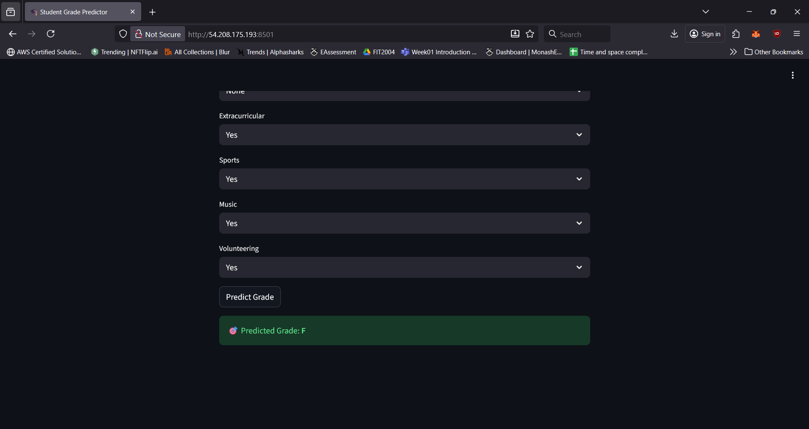
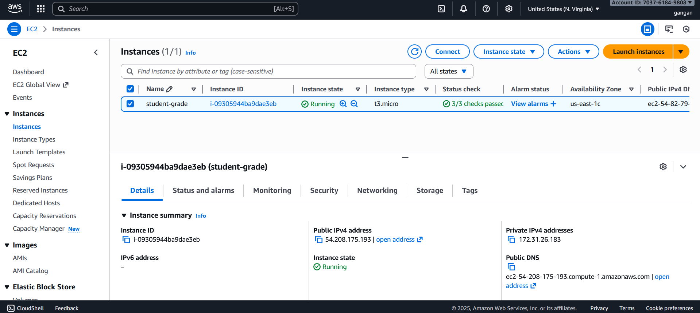

# 🎓 Students Performance Prediction using Machine Learning  
### Machine Learning Zoomcamp Midterm Project  

🚀 **Live Demo:** [Open on Streamlit Cloud](https://machine-learning-zoomcamp-b7ofzjzvjv7ecfyqzubv6k.streamlit.app)


---

## 📘 Dataset Description  

This project uses the **[Students Performance Dataset](https://www.kaggle.com/datasets/rabieelkharoua/students-performance-dataset)** created by *Rabie El Kharoua (2023)*.  
The dataset contains **2,392 high school student records**, covering demographic, academic, and behavioral information.  
The goal is to build a **machine learning model** that predicts a student’s final **GradeClass** (A–F) based on their study habits, parental involvement, and extracurricular activities.  

---

## 🧩 Attribute Information  

### 👤 Student Information
| Feature | Description |
|----------|--------------|
| **StudentID** | Unique identifier for each student (1001–3392) |

### 🧠 Demographic Details
| Feature | Description |
|----------|--------------|
| **Age** | Student’s age (15–18 years) |
| **Gender** | 0 = Male, 1 = Female |
| **Ethnicity** | 0 = Caucasian, 1 = African American, 2 = Asian, 3 = Other |
| **ParentalEducation** | 0 = None, 1 = High School, 2 = Some College, 3 = Bachelor’s, 4 = Higher |

### 📚 Study Habits
| Feature | Description |
|----------|--------------|
| **StudyTimeWeekly** | Weekly study time (hours, 0–20) |
| **Absences** | Number of absences per year (0–30) |
| **Tutoring** | 0 = No, 1 = Yes |

### 👨‍👩‍👧 Parental Involvement
| Feature | Description |
|----------|--------------|
| **ParentalSupport** | Level of support (0 = None, 1 = Low, 2 = Moderate, 3 = High, 4 = Very High) |

### 🎭 Extracurricular Activities
| Feature | Description |
|----------|--------------|
| **Extracurricular** | 0 = No, 1 = Yes |
| **Sports** | 0 = No, 1 = Yes |
| **Music** | 0 = No, 1 = Yes |
| **Volunteering** | 0 = No, 1 = Yes |

### 🎓 Academic Performance
| Feature | Description |
|----------|--------------|
| **GPA** | Grade Point Average (2.0–4.0 scale) — directly influences grade classification |

### 🎯 Target Variable
| Feature | Description |
|----------|--------------|
| **GradeClass** | Classification of grades based on GPA:<br>0 = A (≥3.5), 1 = B (3.0–3.49), 2 = C (2.5–2.99), 3 = D (2.0–2.49), 4 = F (<2.0) |

---

## 🎯 Problem Statement  

Academic success is influenced by multiple factors — study behavior, parental involvement, and extracurricular engagement.  
The aim of this project is to **predict a student's academic performance (GradeClass)** using these behavioral and demographic variables.  

This project seeks to:  
- Identify the most significant predictors of student performance  
- Build classification models to predict grade outcomes  
- Analyze fairness and bias in predictions (especially across demographic groups)  

---

## 🚀 Tools & Libraries  

- **Python 3.12**  
- **Pandas**, **NumPy** — data manipulation and preprocessing  
- **Seaborn**, **Matplotlib** — visualization and correlation analysis  
- **Scikit-learn** — model building and evaluation  
- **Flask**, **Streamlit** — deployment and UI  
- **Pipenv**, **Docker** — environment management  
- **AWS EC2 (Windows Server 2025)** — cloud deployment  

---
## 🧠 Machine-Learning Approach  

1. **Data Preprocessing**  
   - Removed redundant features (e.g., GPA to avoid data leakage)  
   - Handled missing values  
   - Mapped categorical values (e.g., 0/1 → No/Yes)  
   - Standardized column names  

2. **Exploratory Data Analysis**  
   - Pearson correlation with GradeClass  
   - Feature importance via Random Forest  

3. **Model Development**  
   - Logistic Regression (baseline and tuned)  
   - Random Forest (baseline and tuned)  
   - Decision Tree (baseline)  

4. **Evaluation**  
   - Metrics: Accuracy, Precision, Recall, F1 (Macro)  
   - 5-fold cross-validation using `GridSearchCV`  

---

## ⚙️ Deployment Methods  

### 🔹 1️⃣ Run Locally
#### Prerequisites  
- Python 3.10 or newer  
- Pipenv (`pip install pipenv`)  

#### Steps
```bash
git clone https://github.com/NewBBBBBB/machine-learning-zoomcamp
cd machine-learning-zoomcamp/07-midterm
pipenv install
pipenv run python predict.py
pipenv run streamlit run app.py --server.port 8501
```
Then open 👉 http://localhost:8501

---

### 🔹 2️⃣ Run via Docker
```bash
docker build -t student-grade-api .
# Run container
docker run -p 9696:9696 student-grade-api
```
Flask API will be available at 👉 http://localhost:9696/predict

---

### 🔹 3️⃣ Deploy on AWS EC2 (Windows Server 2025)

#### 🧩 Steps

1. **Launch EC2 Instance**
   - **AMI:** Windows Server 2025 – English Full Base (Free Tier eligible)
   - **Instance Type:** `t3.micro` or `t3.small`

2. **Configure Inbound Rules**
   | Port | Protocol | Purpose |
   |------|-----------|----------|
   | 3389 | TCP | Remote Desktop (RDP) |
   | 8501 | TCP | Streamlit UI |
   | 9696 | TCP | Flask API |

3. **Connect via Remote Desktop (RDP)**  
   Log in using your downloaded `.pem` key file to decrypt the Windows administrator password.

4. **Install Dependencies**
   Open **PowerShell** and run:
   ```powershell
   pip install pipenv
   cd C:\machine-learning-zoomcamp\07-midterm
   pipenv install
   ```

5. **Run Both Applications**
```powershell
# Run Flask API
pipenv run python predict.py

# In another PowerShell window
pipenv run streamlit run app.py --server.port 8501 --server.address 0.0.0.0
```

6. **Access Web Apps**
- Streamlit → http://54.208.175.193:8501
- Flask → http://54.208.175.193:9696/predict

7. **After Testing**
- Go to your AWS EC2 Console
- Select the instance
- Click Stop Instance (⚠️ Do not Terminate, or your data will be lost)
- Stopping prevents further billing.

## 🧾 Deployment Proof (AWS)

✅ Successfully deployed **Flask API** and **Streamlit UI** on **AWS EC2 (Windows Server 2025)**.  
The instance type used was **t3.micro (Free Tier)**.  
After successful deployment, the instance was **stopped to avoid additional AWS costs**.  

Below are some screenshots and evidence of the deployment process 👇  

You can find below how the endpoints behaved during deployment:

- **Streamlit UI:** [http://54.208.175.193:8501](http://54.208.175.193:8501)  
- **Flask API:** [http://54.208.175.193:9696/predict](http://54.208.175.193:9696/predict)  

Below are screenshots from the deployed application:  

| Screenshot | Description |
|-------------|--------------|
|  | Streamlit main interface showing student performance prediction input |
|  | Streamlit output displaying predicted GradeClass |
|  | Dashboard summarizing feature importance and model performance |

## 🧩 Acknowledgment  

Dataset by **Rabie El Kharoua** (2023) —  
📊 *Students Performance Dataset: Academic Success Factors in High School Students*  
Licensed under **CC BY 4.0**.  
Link: [https://www.kaggle.com/datasets/rabieelkharoua/students-performance-dataset](https://www.kaggle.com/datasets/rabieelkharoua/students-performance-dataset)

---

## 🏁 Summary  

This project demonstrates how machine learning can be applied to **predict academic success** based on real-world student behavior and family support data.  
The resulting model aims to assist educators in identifying students at risk and implementing early interventions.
